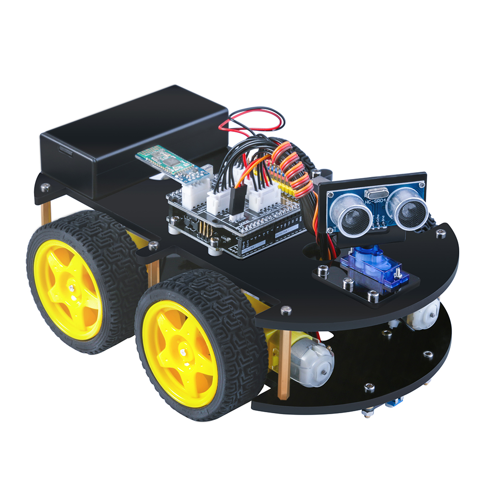

# IoT Smart-Robotic-Car 2019

# Project Proposal
Robotics has been in the major leagues in Technology and has continued growing further on since then, from Smart Robotic Dogs to Self-Driving Smart Cars and A.I. Technology. It has always been one of my major interests and topics to talk about. In my younger years as an infant, I’ve always loved playing around with Remote Controlled Cars and as I grew older it has only furnished good memories when reflecting back. At the age 16 when I still had my RC Car, I dared to open it up out of curiosity to have a peak at the inner workings of the system. I couldn’t have been more fascinated by the mechanics even when I had little knowledge of technology back then, but still, I had the tendency of breaking things and putting it back together. Fast forward to now, I’ve learned so much about the innovation of Technology and how it has had a major impact in our daily lives. The innovation of Autonomous Technology such as Autonomous Drones and Smart-Cars etc. have had a substantial growth over the past few years. Elon Musk’s Tesla Brand which consists of a range of Smart autonomous vehicle Models, from the Tesla Roadster, Model X to the Model Y and the recent debut of the Semi Tesla Truck. The Model 3 of the Tesla Brand also won the ‘Top Safety Award’ from the Insurance Institute for Highway Safety, which is major news, considering that it is always been improved by updates. Vehicle Brands such as Mercedes, Audi, Toyota, Nissan and many others are also pursuing Vehicular Autonomy with their prototypes which is slowly shaping the future of Technology seen in video games into real life.
The Project that I'm going to propose is a Robotic Car controlled by an IR Remote or via a Smartphone.

# Components Required:
- 2 x M3 nuts
- 1 x Aluminium Block
- 2 x M3*30 Hexagon Socket Screws
- 1 x DC Motor
- 8 x M3*10 Hexagon Socket Screws
- 1 x Acrylic Chassis
- 4 x M3*14 Hexagon Socket Screws
- 4 x Separation Shim
- 1 x L298N
- 4 x M3*7 Hexagon Socket Screws 
- 4 x M3*4+6 Single-pass Copper Cylinder
- 4 x M3 Nuts
- 1 x Line Tracking Module
- 3 x M3*14 Hexagon Socket Screws
- 3 x Seperation Shim
- 3 x M3 Nuts
- 1 x Acrylic Chassis
- 1 x UNO R3 Board
- 1 x Ultrasonic Sensor 
- 1 x IO Expansion Board
- 1 x Bluetooth Module
-	ELEGOO BLE Tool Application   Optional  

# Functionality of the Project
- Bluetooth Mode: 

Under this mode, the Robot will be controlled using the ELEGOO BLE Tool APP that can be downloaded from the App Store for iPhones and Google Play for Android Phones and pair with the HC-08 module which will allow connection via Bluetooth. The HC-08 Bluetooth module is a new generation of Bluetooth specification V4.0 BLE Bluetooth protocol based on the transmission module. It works in the 2.4GHz ISM band and uses GFSK modulation. The maximum transmission power is 4dBm and has -93dBm receiving sensitivity. GFSK stands for Gaussian frequency-shift keying which is a type of FSK modulation which uses a Gaussian filter to shape the pulses before they are modulated. This reduces the spectral bandwidth and out-of-band spectrum, to meet adjacent-channel power rejection requirements. This mode only becomes available when the #1 key on the IR-Remote is pressed.

- IR-Remote Control Mode:

Under this mode, the Robot is controlled via the IR-Remote Control. When a forward (up-arrow) signal for example is triggered to the infrared sensor that’s located in the expansion board, the Robot moves accordingly. The same functions also go for ‘Left’ (left-arrow), ‘Right’ (right-arrow) and ‘Down’ (down-arrow) This mode only becomes available when the #2 key on the IR-Remote is pressed. 

- Obstactle-Avoidance Mode: 

Under this mode the Robotic Car will be able to automatically detect obstacles ahead of it no matter which direction it is coming from with the ultrasonic sensors on the platform by sending waves and calculating the distance as Ultrasonic Sensor emit sound waves at a frequency too high for humans to hear. They then wait for the sound to be reflected back, calculating distance based on the time required. This will give the robot the ability to be autonomous. (make its own decisions) This mode only becomes available when the #3 key on the IR-Remote is pressed. 

- Line-Tracking Mode: 

The line tracking modules at the bottom of the car make sure it follows the runway you design with its infrared transmitter tube and an infrared receiver tube. Make sure your runway is clear enough and long enough then you can enjoy a wonderful car racing show. This mode only becomes available when the #4 key on the IR-Remote is pressed.
  

  Should you have any problems, don't hesitate to contact me on my email at:  [20079462@mail.wit.ie](mailto:20079462@mail.wit.ie)
 or if you find a bug  [open up an issue here](https://github.com/robertsolomon97/Smart-Robotic-Car/issues)

# Acknowledgements
Assistance for this Project can be found on the [Elegoo Website](www.elegoo.com) and the Lesson Notes in the invidual Folders uploaded above.

# FUTURE DEVELOPMENTS
In future updates, I will hope to achieve further functionalities and capabilities with this Arduino-based Project.

# Enjoy!!
